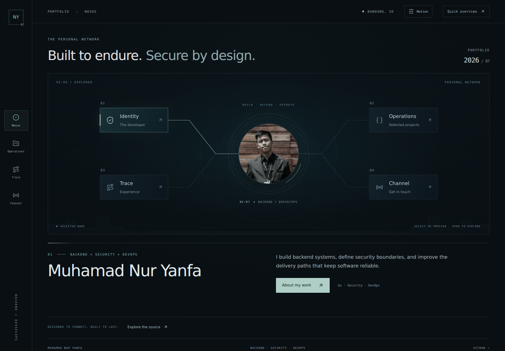
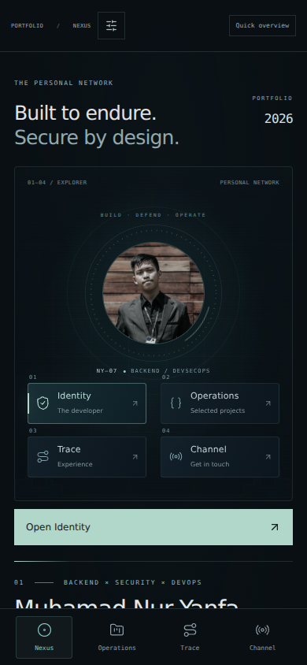

<div align="center">

# Muhamad Nur Yanfa
### Backend · Security · DevOps

**Built to endure. Secure by design.**

A personal portfolio connecting backend engineering, defensive security, and reliable software delivery through a cybersecurity × anime-inspired interface.

[Explore the live portfolio](https://www.nuryanfa.my.id/) · [Quick overview](https://www.nuryanfa.my.id/overview) · [Selected work](https://www.nuryanfa.my.id/archive) · [Contact](https://www.nuryanfa.my.id/network)

</div>

---

[](https://www.nuryanfa.my.id/)

<details>
<summary>View the mobile experience</summary>



</details>

## About the portfolio

I am Muhamad Nur Yanfa, based in Bandung, Indonesia. I build backend systems, define security boundaries, and improve the delivery paths that keep software reliable.

This repository contains the frontend of my portfolio. The backend, infrastructure, and security projects featured on the site live in their own linked repositories.

The experience uses an interactive **Nexus** as its entry point: select a node to preview a section, then open it to explore the work. A **Quick overview** offers a direct route to the essentials.

## Explore

| Section | What you will find |
| --- | --- |
| [Nexus](https://www.nuryanfa.my.id/) | Interactive identity, projects, experience, and contact nodes |
| [Operations](https://www.nuryanfa.my.id/archive) | Seven selected projects, scope and status labels, source links, and three-stage concept maps |
| [Trace](https://www.nuryanfa.my.id/timeline) | DevOps, fullstack, and backend experience |
| [Channel](https://www.nuryanfa.my.id/network) | Email, GitHub, and LinkedIn contact channels |
| [Quick overview](https://www.nuryanfa.my.id/overview) | A concise summary of work, experience, and ways to connect |

## Selected engineering work

Project statuses below reflect the portfolio content at the time of this documentation.

| Project | Focus | Portfolio status |
| --- | --- | --- |
| [AegisGate](https://github.com/Nuryanfa/AegisGate) | Go API gateway with request security, Redis-backed limits, observability, and a gRPC control plane | v0.8 released; production-like, not production-ready |
| [TaskForge](https://github.com/Nuryanfa/TaskForge) | Durable background jobs and workflow orchestration in Go | v0.1 foundation; workers and database-backed execution are planned |
| [SecureNet Enterprise Lab](https://github.com/Nuryanfa/securenet-enterprise-lab) | Network segmentation, detection engineering, and attack simulations | Deployed lab |
| [Zenith Task Manager](https://github.com/Nuryanfa/TaskManager) | MERN task management, Kanban planning, and focus sessions | Repository |
| [Smart Sprint Training System](https://github.com/Nuryanfa/DeteksiPose-Lari) | Markerless pose estimation and athlete session analysis | In development |
| Certificate Validation System | X.509 validation architecture and explicit trust boundaries | Prototype; no dedicated source repository linked |
| [E-Commerce SQA](https://github.com/Nuryanfa/e-commerse-sqa) | Critical commerce flows and repeatable quality workflows | Archived |

Concept maps on the site explain project themes; they are not live infrastructure telemetry. Follow each source link for implementation details.

## Experience highlights

- **DevOps Engineer — NTI:** server and hosting setup, team delivery workflows, and CI/CD.
- **Fullstack Developer — SI MANTAP:** university application features and student guidance workflows.
- **Backend Engineer Intern — Digitak Labs:** API development, relational data design, and GitLab delivery workflows.

[Explore the experience timeline →](https://www.nuryanfa.my.id/timeline)

## Interface and interaction

- **Cybersecurity × anime visual direction:** dark surfaces, restrained teal accents, fine circuit lines, a portrait core, and an abstract city horizon.
- **Purposeful motion:** route transitions, staggered content reveals, shared selection indicators, spring-based interactions, and brief signal responses.
- **Responsive navigation:** a desktop rail, mobile bottom navigation, and touch-friendly section and project controls.
- **Motion preferences:** Device, Full, and Reduced modes, with device preferences respected in Device mode and the selection saved locally.
- **Keyboard support:** skip-to-content navigation and project/contact tabs with arrow-key, Home, and End selection.
- **Shareable project selections:** project query parameters and session-based selection memory.

## Stack

| Layer | Technology |
| --- | --- |
| Interface | React 18 · React Router |
| Build tooling | Vite |
| Styling | Tailwind CSS · custom CSS |
| Motion | Framer Motion · Anime.js |
| Icons | Lucide React |
| Typography | Space Grotesk · JetBrains Mono |
| Hosting and measurements | Vercel · Vercel Analytics · Speed Insights |

## Run locally

Use Node.js 22 or newer and npm.

```bash
git clone https://github.com/Nuryanfa/webporto-security.git
cd webporto-security
npm ci
npm run dev
```

Open the local URL printed by Vite, usually `http://localhost:5173`. No application secrets or database setup are required for this frontend.

| Command | Purpose |
| --- | --- |
| `npm run dev` | Start the development server |
| `npm run build` | Create the production build in `dist/` |
| `npm run preview` | Serve the production build locally |
| `npm run test:smoke` | Check server-rendered pages, project deep links, and content consistency |

The smoke check validates rendering and data relationships; it does not replace browser testing of motion, keyboard navigation, or mobile layouts.

## Maintain the portfolio

Content lives in `src/content/`: profile positioning, projects, experience, and concept-map stages can be updated without rewriting the page layout.

See [the development guide](docs/DEVELOPMENT.md) for the source layout, content-editing rules, verification steps, and deployment settings.

## Connect

[GitHub](https://github.com/Nuryanfa) · [LinkedIn](https://www.linkedin.com/in/muhamad-nur-yanfa-069036368) · [Email](mailto:nuryanfa93@gmail.com)

Built and maintained by **Muhamad Nur Yanfa**.
